My project
================
Rainbow
2024-10-11

``` r
library(haven)
library(dplyr)
```

    ## 
    ## Attaching package: 'dplyr'

    ## The following objects are masked from 'package:stats':
    ## 
    ##     filter, lag

    ## The following objects are masked from 'package:base':
    ## 
    ##     intersect, setdiff, setequal, union

``` r
library(tidyr)
library(ggplot2)
library(psych)
```

    ## 
    ## Attaching package: 'psych'

    ## The following objects are masked from 'package:ggplot2':
    ## 
    ##     %+%, alpha

``` r
library(bruceR)
```

    ## 
    ## bruceR (v2024.6)
    ## Broadly Useful Convenient and Efficient R functions
    ## 
    ## Packages also loaded:
    ## ✔ data.table ✔ emmeans
    ## ✔ dplyr      ✔ lmerTest
    ## ✔ tidyr      ✔ effectsize
    ## ✔ stringr    ✔ performance
    ## ✔ ggplot2    ✔ interactions
    ## 
    ## Main functions of `bruceR`:
    ## cc()             Describe()  TTEST()
    ## add()            Freq()      MANOVA()
    ## .mean()          Corr()      EMMEANS()
    ## set.wd()         Alpha()     PROCESS()
    ## import()         EFA()       model_summary()
    ## print_table()    CFA()       lavaan_summary()
    ## 
    ## For full functionality, please install all dependencies:
    ## install.packages("bruceR", dep=TRUE)
    ## 
    ## Online documentation:
    ## https://psychbruce.github.io/bruceR
    ## 
    ## To use this package in publications, please cite:
    ## Bao, H.-W.-S. (2024). bruceR: Broadly useful convenient and efficient R functions (Version 2024.6) [Computer software]. https://CRAN.R-project.org/package=bruceR

    ## 
    ## These packages are dependencies of `bruceR` but not installed:
    ## - pacman, openxlsx, ggtext, lmtest, vars, phia, MuMIn, GGally
    ## 
    ## ***** Install all dependencies *****
    ## install.packages("bruceR", dep=TRUE)

``` r
library(ggsci)
library(see)
```

    ## 
    ## Attaching package: 'see'

    ## The following objects are masked from 'package:ggsci':
    ## 
    ##     scale_color_material, scale_colour_material, scale_fill_material

``` r
library(car)
```

    ## Loading required package: carData

    ## 
    ## Attaching package: 'car'

    ## The following object is masked from 'package:psych':
    ## 
    ##     logit

    ## The following object is masked from 'package:dplyr':
    ## 
    ##     recode

``` r
library(Rmisc)
```

    ## Loading required package: lattice

    ## Loading required package: plyr

    ## ------------------------------------------------------------------------------

    ## You have loaded plyr after dplyr - this is likely to cause problems.
    ## If you need functions from both plyr and dplyr, please load plyr first, then dplyr:
    ## library(plyr); library(dplyr)

    ## ------------------------------------------------------------------------------

    ## 
    ## Attaching package: 'plyr'

    ## The following objects are masked from 'package:dplyr':
    ## 
    ##     arrange, count, desc, failwith, id, mutate, rename, summarise,
    ##     summarize

``` r
library(rstatix)
```

    ## 
    ## Attaching package: 'rstatix'

    ## The following objects are masked from 'package:plyr':
    ## 
    ##     desc, mutate

    ## The following objects are masked from 'package:effectsize':
    ## 
    ##     cohens_d, eta_squared

    ## The following object is masked from 'package:stats':
    ## 
    ##     filter

``` r
library(emmeans)
library(labelled)
library(ggstatsplot)
```

    ## You can cite this package as:
    ##      Patil, I. (2021). Visualizations with statistical details: The 'ggstatsplot' approach.
    ##      Journal of Open Source Software, 6(61), 3167, doi:10.21105/joss.03167

``` r
library(performance)
library(sjPlot)

dataset <- read.csv("/Users/rainbow/Documents/project\ dataset.csv")
```

\#Recode variables

``` r
dataset <- dataset %>%
  mutate_at(c('gender'),funs(str_replace(., "1", "Men")))
```

    ## Warning: `funs()` was deprecated in dplyr 0.8.0.
    ## ℹ Please use a list of either functions or lambdas:
    ## 
    ## # Simple named list: list(mean = mean, median = median)
    ## 
    ## # Auto named with `tibble::lst()`: tibble::lst(mean, median)
    ## 
    ## # Using lambdas list(~ mean(., trim = .2), ~ median(., na.rm = TRUE))
    ## Call `lifecycle::last_lifecycle_warnings()` to see where this warning was
    ## generated.

``` r
dataset <- dataset %>%
  mutate_at(c('gender'),funs(str_replace(., "2", "Women")))
```

    ## Warning: `funs()` was deprecated in dplyr 0.8.0.
    ## ℹ Please use a list of either functions or lambdas:
    ## 
    ## # Simple named list: list(mean = mean, median = median)
    ## 
    ## # Auto named with `tibble::lst()`: tibble::lst(mean, median)
    ## 
    ## # Using lambdas list(~ mean(., trim = .2), ~ median(., na.rm = TRUE))
    ## Call `lifecycle::last_lifecycle_warnings()` to see where this warning was
    ## generated.

\#Regression (SE, power, authenticity) \##Correlation

``` r
regression <- dataset %>%
  select(power, authenticity, Self_esteem, relationship_satis)

Corr(regression)
```

    ## Pearson's r and 95% confidence intervals:
    ## ────────────────────────────────────────────────────────────────
    ##                                     r     [95% CI]     p       N
    ## ────────────────────────────────────────────────────────────────
    ## power-authenticity               0.44 [0.27, 0.58] <.001 *** 104
    ## power-Self_esteem                0.61 [0.47, 0.72] <.001 *** 104
    ## power-relationship_satis         0.37 [0.19, 0.53] <.001 *** 104
    ## authenticity-Self_esteem         0.61 [0.47, 0.72] <.001 *** 104
    ## authenticity-relationship_satis  0.37 [0.19, 0.53] <.001 *** 104
    ## Self_esteem-relationship_satis   0.48 [0.32, 0.62] <.001 *** 104
    ## ────────────────────────────────────────────────────────────────

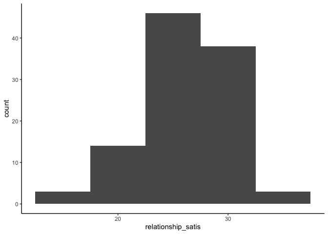<!-- -->

    ## Correlation matrix is displayed in the RStudio `Plots` Pane.

\##Regression

``` r
model<-lm(relationship_satis ~ power + authenticity + Self_esteem, data = regression)

check_model(model)
```

<!-- -->

``` r
model_summary(model)
```

    ## 
    ## Model Summary
    ## 
    ## ────────────────────────────────────
    ##               (1) relationship_satis
    ## ────────────────────────────────────
    ## (Intercept)    10.728 ***           
    ##                (2.772)              
    ## power           0.109               
    ##                (0.106)              
    ## authenticity    0.069               
    ##                (0.065)              
    ## Self_esteem     0.245 **            
    ##                (0.089)              
    ## ────────────────────────────────────
    ## R^2             0.248               
    ## Adj. R^2        0.226               
    ## Num. obs.     104                   
    ## ────────────────────────────────────
    ## Note. * p < .05, ** p < .01, *** p < .001.
    ## 
    ## # Check for Multicollinearity
    ## 
    ## Low Correlation
    ## 
    ##          Term  VIF   VIF 95% CI Increased SE Tolerance Tolerance 95% CI
    ##         power 1.60 [1.31, 2.17]         1.27      0.62     [0.46, 0.76]
    ##  authenticity 1.60 [1.31, 2.16]         1.27      0.62     [0.46, 0.76]
    ##   Self_esteem 2.05 [1.62, 2.79]         1.43      0.49     [0.36, 0.62]

``` r
tab_model(model)
```

<table style="border-collapse:collapse; border:none;">
<tr>
<th style="border-top: double; text-align:center; font-style:normal; font-weight:bold; padding:0.2cm;  text-align:left; ">
 
</th>
<th colspan="3" style="border-top: double; text-align:center; font-style:normal; font-weight:bold; padding:0.2cm; ">
relationship_satis
</th>
</tr>
<tr>
<td style=" text-align:center; border-bottom:1px solid; font-style:italic; font-weight:normal;  text-align:left; ">
Predictors
</td>
<td style=" text-align:center; border-bottom:1px solid; font-style:italic; font-weight:normal;  ">
Estimates
</td>
<td style=" text-align:center; border-bottom:1px solid; font-style:italic; font-weight:normal;  ">
CI
</td>
<td style=" text-align:center; border-bottom:1px solid; font-style:italic; font-weight:normal;  ">
p
</td>
</tr>
<tr>
<td style=" padding:0.2cm; text-align:left; vertical-align:top; text-align:left; ">
(Intercept)
</td>
<td style=" padding:0.2cm; text-align:left; vertical-align:top; text-align:center;  ">
10.73
</td>
<td style=" padding:0.2cm; text-align:left; vertical-align:top; text-align:center;  ">
5.23 – 16.23
</td>
<td style=" padding:0.2cm; text-align:left; vertical-align:top; text-align:center;  ">
<strong>\<0.001</strong>
</td>
</tr>
<tr>
<td style=" padding:0.2cm; text-align:left; vertical-align:top; text-align:left; ">
power
</td>
<td style=" padding:0.2cm; text-align:left; vertical-align:top; text-align:center;  ">
0.11
</td>
<td style=" padding:0.2cm; text-align:left; vertical-align:top; text-align:center;  ">
-0.10 – 0.32
</td>
<td style=" padding:0.2cm; text-align:left; vertical-align:top; text-align:center;  ">
0.308
</td>
</tr>
<tr>
<td style=" padding:0.2cm; text-align:left; vertical-align:top; text-align:left; ">
authenticity
</td>
<td style=" padding:0.2cm; text-align:left; vertical-align:top; text-align:center;  ">
0.07
</td>
<td style=" padding:0.2cm; text-align:left; vertical-align:top; text-align:center;  ">
-0.06 – 0.20
</td>
<td style=" padding:0.2cm; text-align:left; vertical-align:top; text-align:center;  ">
0.292
</td>
</tr>
<tr>
<td style=" padding:0.2cm; text-align:left; vertical-align:top; text-align:left; ">
Self esteem
</td>
<td style=" padding:0.2cm; text-align:left; vertical-align:top; text-align:center;  ">
0.25
</td>
<td style=" padding:0.2cm; text-align:left; vertical-align:top; text-align:center;  ">
0.07 – 0.42
</td>
<td style=" padding:0.2cm; text-align:left; vertical-align:top; text-align:center;  ">
<strong>0.007</strong>
</td>
</tr>
<tr>
<td style=" padding:0.2cm; text-align:left; vertical-align:top; text-align:left; padding-top:0.1cm; padding-bottom:0.1cm; border-top:1px solid;">
Observations
</td>
<td style=" padding:0.2cm; text-align:left; vertical-align:top; padding-top:0.1cm; padding-bottom:0.1cm; text-align:left; border-top:1px solid;" colspan="3">
104
</td>
</tr>
<tr>
<td style=" padding:0.2cm; text-align:left; vertical-align:top; text-align:left; padding-top:0.1cm; padding-bottom:0.1cm;">
R<sup>2</sup> / R<sup>2</sup> adjusted
</td>
<td style=" padding:0.2cm; text-align:left; vertical-align:top; padding-top:0.1cm; padding-bottom:0.1cm; text-align:left;" colspan="3">
0.248 / 0.226
</td>
</tr>
</table>

``` r
plot_model(model,  type ="est",  show.values = TRUE, vline.color = "#1B191999", line.size = 1.5, dot.size = 2.5, colors = "#276bbd") + theme_bruce() +
  labs(
    title = "Relationship Satisfaction",
  )
```

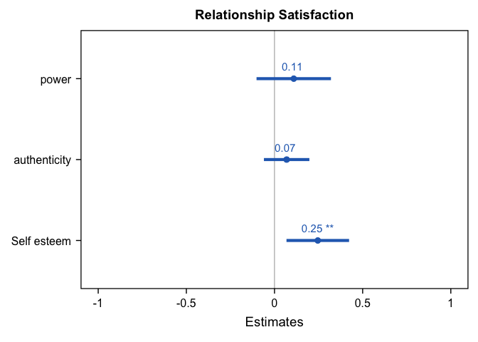<!-- --> \#
Regression (SE and gender) \## Correlation

``` r
dataset <- dataset %>%
  mutate_at(c('gender'),funs(str_replace(., "Men", "1")))
```

    ## Warning: `funs()` was deprecated in dplyr 0.8.0.
    ## ℹ Please use a list of either functions or lambdas:
    ## 
    ## # Simple named list: list(mean = mean, median = median)
    ## 
    ## # Auto named with `tibble::lst()`: tibble::lst(mean, median)
    ## 
    ## # Using lambdas list(~ mean(., trim = .2), ~ median(., na.rm = TRUE))
    ## Call `lifecycle::last_lifecycle_warnings()` to see where this warning was
    ## generated.

``` r
dataset <- dataset %>%
  mutate_at(c('gender'),funs(str_replace(., "Women", "2")))
```

    ## Warning: `funs()` was deprecated in dplyr 0.8.0.
    ## ℹ Please use a list of either functions or lambdas:
    ## 
    ## # Simple named list: list(mean = mean, median = median)
    ## 
    ## # Auto named with `tibble::lst()`: tibble::lst(mean, median)
    ## 
    ## # Using lambdas list(~ mean(., trim = .2), ~ median(., na.rm = TRUE))
    ## Call `lifecycle::last_lifecycle_warnings()` to see where this warning was
    ## generated.

``` r
regression2 <- dataset %>%
  select(gender, Self_esteem, relationship_satis)

Corr(regression2)
```

    ## NOTE: `gender` transformed to numeric.
    ## 
    ## Pearson's r and 95% confidence intervals:
    ## ─────────────────────────────────────────────────────────────────
    ##                                     r      [95% CI]     p       N
    ## ─────────────────────────────────────────────────────────────────
    ## gender-Self_esteem              -0.06 [-0.25, 0.13]  .524     104
    ## gender-relationship_satis        0.04 [-0.15, 0.23]  .669     104
    ## Self_esteem-relationship_satis   0.48 [ 0.32, 0.62] <.001 *** 104
    ## ─────────────────────────────────────────────────────────────────

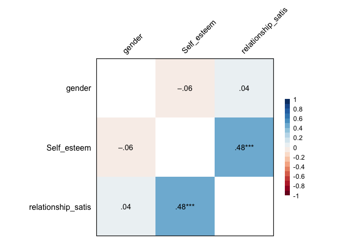<!-- -->

    ## Correlation matrix is displayed in the RStudio `Plots` Pane.

## Regression

``` r
model<-lm(relationship_satis ~ Self_esteem * gender, data = regression2)

check_model(model)
```

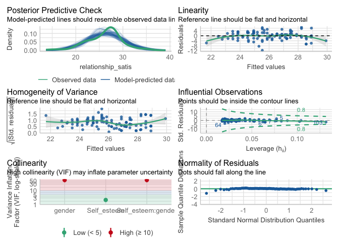<!-- -->

``` r
model_summary(model)
```

    ## 
    ## Model Summary
    ## 
    ## ───────────────────────────────────────────
    ##                      (1) relationship_satis
    ## ───────────────────────────────────────────
    ## (Intercept)           11.919 **            
    ##                       (3.599)              
    ## Self_esteem            0.362 ***           
    ##                       (0.092)              
    ## gender2                1.457               
    ##                       (4.902)              
    ## Self_esteem:gender2   -0.024               
    ##                       (0.127)              
    ## ───────────────────────────────────────────
    ## R^2                    0.235               
    ## Adj. R^2               0.212               
    ## Num. obs.            104                   
    ## ───────────────────────────────────────────
    ## Note. * p < .05, ** p < .01, *** p < .001.

    ## Model has interaction terms. VIFs might be inflated.
    ##   You may check multicollinearity among predictors of a model without
    ##   interaction terms.

    ## # Check for Multicollinearity
    ## 
    ## Low Correlation
    ## 
    ##         Term  VIF     VIF 95% CI Increased SE Tolerance Tolerance 95% CI
    ##  Self_esteem 2.14 [ 1.68,  2.91]         1.46      0.47     [0.34, 0.60]
    ## 
    ## High Correlation
    ## 
    ##                Term   VIF     VIF 95% CI Increased SE Tolerance
    ##              gender 58.33 [40.84, 83.49]         7.64      0.02
    ##  Self_esteem:gender 58.44 [40.92, 83.65]         7.64      0.02
    ##  Tolerance 95% CI
    ##      [0.01, 0.02]
    ##      [0.01, 0.02]

``` r
tab_model(model)
```

<table style="border-collapse:collapse; border:none;">
<tr>
<th style="border-top: double; text-align:center; font-style:normal; font-weight:bold; padding:0.2cm;  text-align:left; ">
 
</th>
<th colspan="3" style="border-top: double; text-align:center; font-style:normal; font-weight:bold; padding:0.2cm; ">
relationship_satis
</th>
</tr>
<tr>
<td style=" text-align:center; border-bottom:1px solid; font-style:italic; font-weight:normal;  text-align:left; ">
Predictors
</td>
<td style=" text-align:center; border-bottom:1px solid; font-style:italic; font-weight:normal;  ">
Estimates
</td>
<td style=" text-align:center; border-bottom:1px solid; font-style:italic; font-weight:normal;  ">
CI
</td>
<td style=" text-align:center; border-bottom:1px solid; font-style:italic; font-weight:normal;  ">
p
</td>
</tr>
<tr>
<td style=" padding:0.2cm; text-align:left; vertical-align:top; text-align:left; ">
(Intercept)
</td>
<td style=" padding:0.2cm; text-align:left; vertical-align:top; text-align:center;  ">
11.92
</td>
<td style=" padding:0.2cm; text-align:left; vertical-align:top; text-align:center;  ">
4.78 – 19.06
</td>
<td style=" padding:0.2cm; text-align:left; vertical-align:top; text-align:center;  ">
<strong>0.001</strong>
</td>
</tr>
<tr>
<td style=" padding:0.2cm; text-align:left; vertical-align:top; text-align:left; ">
Self esteem
</td>
<td style=" padding:0.2cm; text-align:left; vertical-align:top; text-align:center;  ">
0.36
</td>
<td style=" padding:0.2cm; text-align:left; vertical-align:top; text-align:center;  ">
0.18 – 0.54
</td>
<td style=" padding:0.2cm; text-align:left; vertical-align:top; text-align:center;  ">
<strong>\<0.001</strong>
</td>
</tr>
<tr>
<td style=" padding:0.2cm; text-align:left; vertical-align:top; text-align:left; ">
gender \[2\]
</td>
<td style=" padding:0.2cm; text-align:left; vertical-align:top; text-align:center;  ">
1.46
</td>
<td style=" padding:0.2cm; text-align:left; vertical-align:top; text-align:center;  ">
-8.27 – 11.18
</td>
<td style=" padding:0.2cm; text-align:left; vertical-align:top; text-align:center;  ">
0.767
</td>
</tr>
<tr>
<td style=" padding:0.2cm; text-align:left; vertical-align:top; text-align:left; ">
Self esteem × gender \[2\]
</td>
<td style=" padding:0.2cm; text-align:left; vertical-align:top; text-align:center;  ">
-0.02
</td>
<td style=" padding:0.2cm; text-align:left; vertical-align:top; text-align:center;  ">
-0.28 – 0.23
</td>
<td style=" padding:0.2cm; text-align:left; vertical-align:top; text-align:center;  ">
0.850
</td>
</tr>
<tr>
<td style=" padding:0.2cm; text-align:left; vertical-align:top; text-align:left; padding-top:0.1cm; padding-bottom:0.1cm; border-top:1px solid;">
Observations
</td>
<td style=" padding:0.2cm; text-align:left; vertical-align:top; padding-top:0.1cm; padding-bottom:0.1cm; text-align:left; border-top:1px solid;" colspan="3">
104
</td>
</tr>
<tr>
<td style=" padding:0.2cm; text-align:left; vertical-align:top; text-align:left; padding-top:0.1cm; padding-bottom:0.1cm;">
R<sup>2</sup> / R<sup>2</sup> adjusted
</td>
<td style=" padding:0.2cm; text-align:left; vertical-align:top; padding-top:0.1cm; padding-bottom:0.1cm; text-align:left;" colspan="3">
0.235 / 0.212
</td>
</tr>
</table>

``` r
plot_model(
  model,
  type = "est",
  show.values = TRUE,
  vline.color = "#1B191999",
  line.size = 1.5,
  dot.size = 2.5,
  colors = "#276bbd",
  axis.labels = c("Self esteem x Gender", "Gender", "Self esteem")
) +
  theme_bruce() +
  labs(
    title = "Relationship Satisfaction"
  )
```

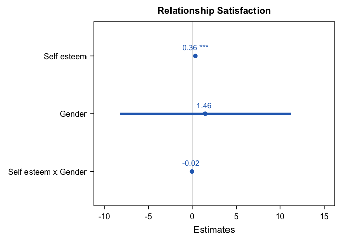<!-- -->

# Reliability for self-esteem

``` r
Alpha(dataset, "se", 1:10)
```

    ## 
    ## Reliability Analysis
    ## 
    ## Summary:
    ## Total Items: 10
    ## Scale Range: 1 ~ 5
    ## Total Cases: 104
    ## Valid Cases: 104 (100.0%)
    ## 
    ## Scale Statistics:
    ## Mean = 3.834
    ## S.D. = 0.508
    ## Cronbach’s α = 0.807
    ## McDonald’s ω = 0.821
    ## 
    ## Item Statistics (Cronbach’s α If Item Deleted):
    ## ───────────────────────────────────────────────
    ##        Mean    S.D. Item-Rest Cor. Cronbach’s α
    ## ───────────────────────────────────────────────
    ## se1   3.875 (0.678)          0.412        0.798
    ## se2   3.452 (1.148)          0.599        0.777
    ## se3   3.913 (0.625)          0.463        0.794
    ## se4   4.010 (0.512)          0.373        0.802
    ## se5   3.317 (0.948)          0.522        0.786
    ## se6   3.596 (1.137)          0.561        0.783
    ## se7   3.990 (0.690)          0.583        0.782
    ## se8   3.856 (0.939)          0.338        0.808
    ## se9   4.231 (0.803)          0.551        0.783
    ## se10  4.096 (0.661)          0.567        0.784
    ## ───────────────────────────────────────────────
    ## Item-Rest Cor. = Corrected Item-Total Correlation

# Reliability for relationship satisfaction

``` r
colnames(dataset)[colnames(dataset) == "Relationship1"] <- "R1"

Alpha(dataset, "R", 1:7)
```

    ## 
    ## Reliability Analysis
    ## 
    ## Summary:
    ## Total Items: 7
    ## Scale Range: 1 ~ 5
    ## Total Cases: 104
    ## Valid Cases: 104 (100.0%)
    ## 
    ## Scale Statistics:
    ## Mean = 3.727
    ## S.D. = 0.523
    ## Cronbach’s α = 0.824
    ## McDonald’s ω = 0.825
    ## 
    ## Item Statistics (Cronbach’s α If Item Deleted):
    ## ─────────────────────────────────────────────
    ##      Mean    S.D. Item-Rest Cor. Cronbach’s α
    ## ─────────────────────────────────────────────
    ## R1  4.077 (0.720)          0.488        0.812
    ## R2  3.750 (0.679)          0.444        0.818
    ## R3  3.827 (0.660)          0.534        0.805
    ## R4  3.567 (0.773)          0.633        0.788
    ## R5  3.625 (0.815)          0.709        0.774
    ## R6  3.519 (0.800)          0.520        0.808
    ## R7  3.721 (0.794)          0.636        0.788
    ## ─────────────────────────────────────────────
    ## Item-Rest Cor. = Corrected Item-Total Correlation

# Exploratory Factor Analysis for Self-esteem

``` r
EFA(dataset, "se", 1:10, method = "pa", plot.scree = TRUE, nfactors = c("parallel"))
```

    ## 
    ## Explanatory Factor Analysis
    ## 
    ## Summary:
    ## Total Items: 10
    ## Scale Range: 1 ~ 5
    ## Total Cases: 104
    ## Valid Cases: 104 (100.0%)
    ## 
    ## Extraction Method:
    ## - Principal Axis Factor Analysis
    ## Rotation Method:
    ## - (Only one component was extracted. The solution was not rotated.)
    ## 
    ## KMO and Bartlett's Test:
    ## - Kaiser-Meyer-Olkin (KMO) Measure of Sampling Adequacy: MSA = 0.789
    ## - Bartlett's Test of Sphericity: Approx. χ²(45) = 300.15, p = 2e-39 ***
    ## 
    ## Total Variance Explained:
    ## ────────────────────────────────────────────────────────────────────────────────
    ##            Eigenvalue Variance % Cumulative % SS Loading Variance % Cumulative %
    ## ────────────────────────────────────────────────────────────────────────────────
    ## Factor 1        3.854     38.536       38.536      3.204     32.037       32.037
    ## Factor 2        1.225     12.255       50.791                                   
    ## Factor 3        1.031     10.307       61.098                                   
    ## Factor 4        0.868      8.676       69.774                                   
    ## Factor 5        0.683      6.831       76.605                                   
    ## Factor 6        0.664      6.641       83.246                                   
    ## Factor 7        0.655      6.546       89.792                                   
    ## Factor 8        0.409      4.090       93.882                                   
    ## Factor 9        0.311      3.106       96.989                                   
    ## Factor 10       0.301      3.011      100.000                                   
    ## ────────────────────────────────────────────────────────────────────────────────
    ## 
    ## Factor Loadings (Sorted by Size):
    ## ───────────────────────
    ##         PA1 Communality
    ## ───────────────────────
    ## se10  0.664       0.440
    ## se7   0.658       0.433
    ## se2   0.633       0.400
    ## se9   0.621       0.386
    ## se6   0.603       0.364
    ## se5   0.569       0.323
    ## se3   0.560       0.314
    ## se1   0.471       0.222
    ## se4   0.439       0.192
    ## se8   0.359       0.129
    ## ───────────────────────
    ## Communality = Sum of Squared (SS) Factor Loadings
    ## (Uniqueness = 1 - Communality)

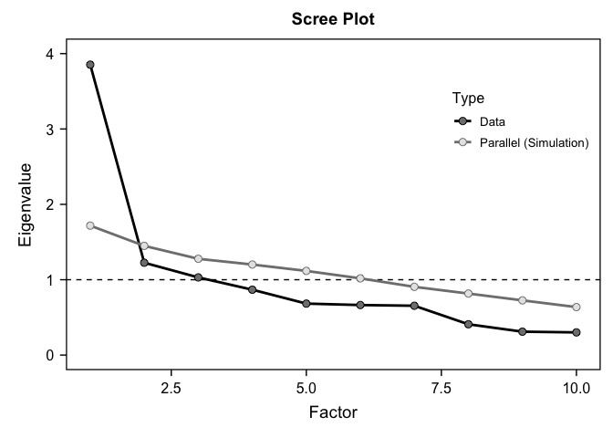<!-- -->

# Exploratory Factor Analysis for relationship satisfaction

``` r
EFA(dataset, "R", 1:7, method = "pa", plot.scree = TRUE, nfactors = c("parallel"))
```

    ## 
    ## Explanatory Factor Analysis
    ## 
    ## Summary:
    ## Total Items: 7
    ## Scale Range: 1 ~ 5
    ## Total Cases: 104
    ## Valid Cases: 104 (100.0%)
    ## 
    ## Extraction Method:
    ## - Principal Axis Factor Analysis
    ## Rotation Method:
    ## - (Only one component was extracted. The solution was not rotated.)
    ## 
    ## KMO and Bartlett's Test:
    ## - Kaiser-Meyer-Olkin (KMO) Measure of Sampling Adequacy: MSA = 0.803
    ## - Bartlett's Test of Sphericity: Approx. χ²(21) = 244.78, p = 5e-40 ***
    ## 
    ## Total Variance Explained:
    ## ───────────────────────────────────────────────────────────────────────────────
    ##           Eigenvalue Variance % Cumulative % SS Loading Variance % Cumulative %
    ## ───────────────────────────────────────────────────────────────────────────────
    ## Factor 1       3.418     48.831       48.831      2.863     40.903       40.903
    ## Factor 2       1.002     14.319       63.150                                   
    ## Factor 3       0.776     11.083       74.233                                   
    ## Factor 4       0.745     10.644       84.878                                   
    ## Factor 5       0.393      5.609       90.486                                   
    ## Factor 6       0.343      4.905       95.391                                   
    ## Factor 7       0.323      4.609      100.000                                   
    ## ───────────────────────────────────────────────────────────────────────────────
    ## 
    ## Factor Loadings (Sorted by Size):
    ## ─────────────────────
    ##       PA1 Communality
    ## ─────────────────────
    ## R5  0.801       0.642
    ## R4  0.712       0.507
    ## R7  0.701       0.491
    ## R3  0.595       0.354
    ## R6  0.581       0.337
    ## R1  0.545       0.297
    ## R2  0.485       0.235
    ## ─────────────────────
    ## Communality = Sum of Squared (SS) Factor Loadings
    ## (Uniqueness = 1 - Communality)

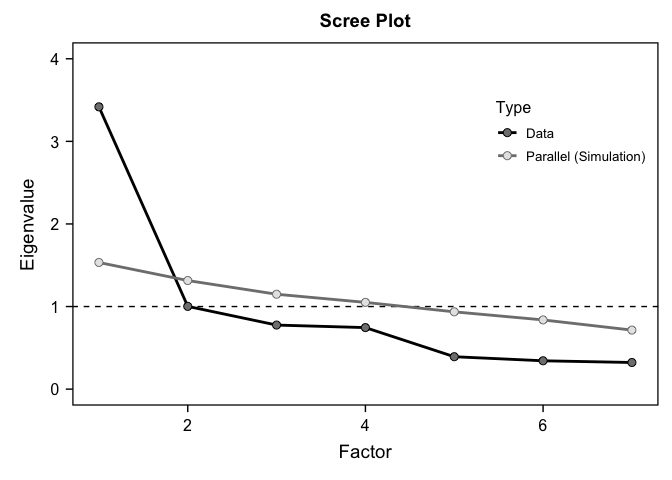<!-- --> \#
Reliability for power and authenticity \## Rename columns

``` r
colnames(dataset)[colnames(dataset) == "Power1"] <- "P1"
colnames(dataset)[colnames(dataset) == "A_Living1"] <- "A1"
colnames(dataset)[colnames(dataset) == "A_Living2"] <- "A2"
colnames(dataset)[colnames(dataset) == "A_Living3"] <- "A3"
colnames(dataset)[colnames(dataset) == "A_L4"] <- "A4"
colnames(dataset)[colnames(dataset) == "A_aliennation1"] <- "A5"
colnames(dataset)[colnames(dataset) == "A_a2"] <- "A6"
colnames(dataset)[colnames(dataset) == "A_a3"] <- "A7"
colnames(dataset)[colnames(dataset) == "A_a4"] <- "A8"
colnames(dataset)[colnames(dataset) == "A_other1"] <- "A9"
colnames(dataset)[colnames(dataset) == "A_o2"] <- "A10"
colnames(dataset)[colnames(dataset) == "A_o3"] <- "A11"
colnames(dataset)[colnames(dataset) == "A_o4"] <- "A12"
```

## Reliability of power

``` r
Alpha(dataset, "P", 1:8)
```

    ## 
    ## Reliability Analysis
    ## 
    ## Summary:
    ## Total Items: 8
    ## Scale Range: 1 ~ 5
    ## Total Cases: 104
    ## Valid Cases: 104 (100.0%)
    ## 
    ## Scale Statistics:
    ## Mean = 3.464
    ## S.D. = 0.473
    ## Cronbach’s α = 0.713
    ## McDonald’s ω = 0.735
    ## 
    ## Item Statistics (Cronbach’s α If Item Deleted):
    ## ─────────────────────────────────────────────
    ##      Mean    S.D. Item-Rest Cor. Cronbach’s α
    ## ─────────────────────────────────────────────
    ## P1  3.356 (0.835)          0.481        0.668
    ## P2  3.606 (0.730)          0.553        0.657
    ## P3  3.221 (0.812)          0.345        0.698
    ## P4  3.740 (0.750)          0.613        0.643
    ## P5  2.481 (0.859)          0.245        0.720
    ## P6  3.587 (0.866)          0.498        0.664
    ## P7  3.933 (0.816)          0.287        0.709
    ## P8  3.788 (0.878)          0.277        0.714
    ## ─────────────────────────────────────────────
    ## Item-Rest Cor. = Corrected Item-Total Correlation

## Reliaibility of authenticity

``` r
Alpha(dataset, "A", 1:4)
```

    ## 
    ## Reliability Analysis
    ## 
    ## Summary:
    ## Total Items: 4
    ## Scale Range: 1 ~ 5
    ## Total Cases: 104
    ## Valid Cases: 104 (100.0%)
    ## 
    ## Scale Statistics:
    ## Mean = 3.906
    ## S.D. = 0.574
    ## Cronbach’s α = 0.710
    ## McDonald’s ω = 0.726
    ## 
    ## Item Statistics (Cronbach’s α If Item Deleted):
    ## ─────────────────────────────────────────────
    ##      Mean    S.D. Item-Rest Cor. Cronbach’s α
    ## ─────────────────────────────────────────────
    ## A1  3.731 (0.906)          0.442        0.692
    ## A2  3.865 (0.801)          0.640        0.554
    ## A3  3.875 (0.797)          0.478        0.659
    ## A4  4.154 (0.604)          0.465        0.673
    ## ─────────────────────────────────────────────
    ## Item-Rest Cor. = Corrected Item-Total Correlation

``` r
Alpha(dataset, "A", 5:8)
```

    ## 
    ## Reliability Analysis
    ## 
    ## Summary:
    ## Total Items: 4
    ## Scale Range: 1 ~ 5
    ## Total Cases: 104
    ## Valid Cases: 104 (100.0%)
    ## 
    ## Scale Statistics:
    ## Mean = 3.692
    ## S.D. = 0.803
    ## Cronbach’s α = 0.842
    ## McDonald’s ω = 0.858
    ## 
    ## Item Statistics (Cronbach’s α If Item Deleted):
    ## ─────────────────────────────────────────────
    ##      Mean    S.D. Item-Rest Cor. Cronbach’s α
    ## ─────────────────────────────────────────────
    ## A5  3.606 (1.037)          0.534        0.864
    ## A6  3.567 (1.022)          0.657        0.809
    ## A7  3.760 (0.919)          0.819        0.740
    ## A8  3.837 (0.915)          0.725        0.780
    ## ─────────────────────────────────────────────
    ## Item-Rest Cor. = Corrected Item-Total Correlation

``` r
Alpha(dataset, "A", 9:12)
```

    ## 
    ## Reliability Analysis
    ## 
    ## Summary:
    ## Total Items: 4
    ## Scale Range: 1 ~ 5
    ## Total Cases: 104
    ## Valid Cases: 104 (100.0%)
    ## 
    ## Scale Statistics:
    ## Mean = 3.024
    ## S.D. = 0.760
    ## Cronbach’s α = 0.809
    ## McDonald’s ω = 0.814
    ## 
    ## Item Statistics (Cronbach’s α If Item Deleted):
    ## ──────────────────────────────────────────────
    ##       Mean    S.D. Item-Rest Cor. Cronbach’s α
    ## ──────────────────────────────────────────────
    ## A9   3.202 (0.979)          0.699        0.724
    ## A10  3.250 (0.922)          0.693        0.729
    ## A11  2.971 (1.019)          0.557        0.796
    ## A12  2.673 (0.886)          0.566        0.788
    ## ──────────────────────────────────────────────
    ## Item-Rest Cor. = Corrected Item-Total Correlation

``` r
Alpha(dataset, "A", 1:12)
```

    ## 
    ## Reliability Analysis
    ## 
    ## Summary:
    ## Total Items: 12
    ## Scale Range: 1 ~ 5
    ## Total Cases: 104
    ## Valid Cases: 104 (100.0%)
    ## 
    ## Scale Statistics:
    ## Mean = 3.541
    ## S.D. = 0.516
    ## Cronbach’s α = 0.809
    ## McDonald’s ω = 0.816
    ## 
    ## Item Statistics (Cronbach’s α If Item Deleted):
    ## ──────────────────────────────────────────────
    ##       Mean    S.D. Item-Rest Cor. Cronbach’s α
    ## ──────────────────────────────────────────────
    ## A1   3.731 (0.906)          0.190        0.818
    ## A2   3.865 (0.801)          0.334        0.805
    ## A3   3.875 (0.797)          0.244        0.812
    ## A4   4.154 (0.604)          0.461        0.797
    ## A5   3.606 (1.037)          0.444        0.797
    ## A6   3.567 (1.022)          0.648        0.775
    ## A7   3.760 (0.919)          0.595        0.782
    ## A8   3.837 (0.915)          0.525        0.789
    ## A9   3.202 (0.979)          0.553        0.786
    ## A10  3.250 (0.922)          0.595        0.782
    ## A11  2.971 (1.019)          0.460        0.795
    ## A12  2.673 (0.886)          0.440        0.796
    ## ──────────────────────────────────────────────
    ## Item-Rest Cor. = Corrected Item-Total Correlation

## Factor analysis for power

``` r
EFA(dataset, "P", 1:8, method = "pa", plot.scree = TRUE, nfactors = 1)
```

    ## 
    ## Explanatory Factor Analysis
    ## 
    ## Summary:
    ## Total Items: 8
    ## Scale Range: 1 ~ 5
    ## Total Cases: 104
    ## Valid Cases: 104 (100.0%)
    ## 
    ## Extraction Method:
    ## - Principal Axis Factor Analysis
    ## Rotation Method:
    ## - (Only one component was extracted. The solution was not rotated.)
    ## 
    ## KMO and Bartlett's Test:
    ## - Kaiser-Meyer-Olkin (KMO) Measure of Sampling Adequacy: MSA = 0.702
    ## - Bartlett's Test of Sphericity: Approx. χ²(28) = 204.59, p = 9e-29 ***
    ## 
    ## Total Variance Explained:
    ## ───────────────────────────────────────────────────────────────────────────────
    ##           Eigenvalue Variance % Cumulative % SS Loading Variance % Cumulative %
    ## ───────────────────────────────────────────────────────────────────────────────
    ## Factor 1       2.847     35.590       35.590      2.255     28.190       28.190
    ## Factor 2       1.503     18.783       54.373                                   
    ## Factor 3       1.064     13.300       67.673                                   
    ## Factor 4       0.809     10.113       77.785                                   
    ## Factor 5       0.624      7.802       85.588                                   
    ## Factor 6       0.440      5.504       91.091                                   
    ## Factor 7       0.380      4.752       95.843                                   
    ## Factor 8       0.333      4.157      100.000                                   
    ## ───────────────────────────────────────────────────────────────────────────────
    ## 
    ## Factor Loadings (Sorted by Size):
    ## ─────────────────────
    ##       PA1 Communality
    ## ─────────────────────
    ## P4  0.787       0.619
    ## P2  0.707       0.500
    ## P6  0.688       0.473
    ## P1  0.493       0.243
    ## P3  0.374       0.140
    ## P8  0.319       0.102
    ## P7  0.311       0.097
    ## P5  0.284       0.080
    ## ─────────────────────
    ## Communality = Sum of Squared (SS) Factor Loadings
    ## (Uniqueness = 1 - Communality)

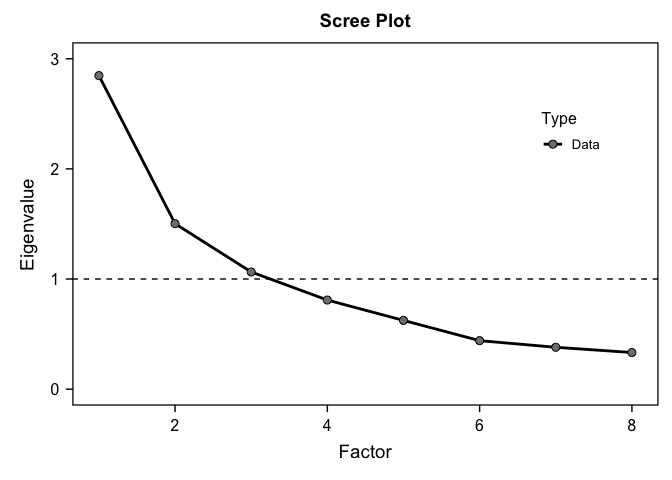<!-- --> \##
Factor analysis for authenticity

``` r
EFA(dataset, "A", 1:4, method = "pa", plot.scree = TRUE, nfactors = c("parallel"))
```

    ## 
    ## Explanatory Factor Analysis
    ## 
    ## Summary:
    ## Total Items: 4
    ## Scale Range: 1 ~ 5
    ## Total Cases: 104
    ## Valid Cases: 104 (100.0%)
    ## 
    ## Extraction Method:
    ## - Principal Axis Factor Analysis
    ## Rotation Method:
    ## - (Only one component was extracted. The solution was not rotated.)
    ## 
    ## KMO and Bartlett's Test:
    ## - Kaiser-Meyer-Olkin (KMO) Measure of Sampling Adequacy: MSA = 0.686
    ## - Bartlett's Test of Sphericity: Approx. χ²(6) = 85.54, p = 3e-16 ***
    ## 
    ## Total Variance Explained:
    ## ───────────────────────────────────────────────────────────────────────────────
    ##           Eigenvalue Variance % Cumulative % SS Loading Variance % Cumulative %
    ## ───────────────────────────────────────────────────────────────────────────────
    ## Factor 1       2.179     54.474       54.474      1.624     40.603       40.603
    ## Factor 2       0.845     21.126       75.600                                   
    ## Factor 3       0.563     14.078       89.678                                   
    ## Factor 4       0.413     10.322      100.000                                   
    ## ───────────────────────────────────────────────────────────────────────────────
    ## 
    ## Factor Loadings (Sorted by Size):
    ## ─────────────────────
    ##       PA1 Communality
    ## ─────────────────────
    ## A2  0.815       0.664
    ## A3  0.598       0.358
    ## A4  0.558       0.312
    ## A1  0.539       0.290
    ## ─────────────────────
    ## Communality = Sum of Squared (SS) Factor Loadings
    ## (Uniqueness = 1 - Communality)

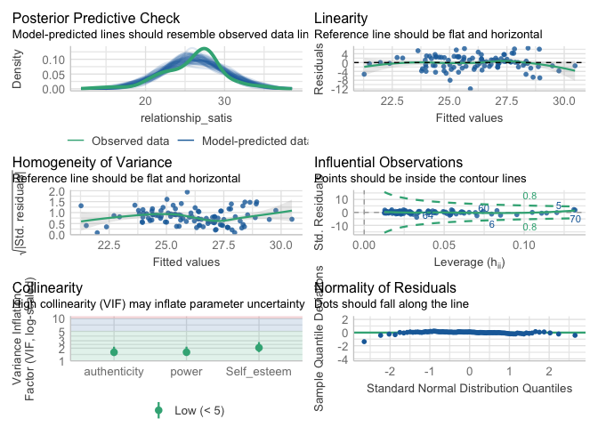<!-- -->

``` r
EFA(dataset, "A", 5:8, method = "pa", plot.scree = TRUE, nfactors = c("parallel"))
```

    ## 
    ## Explanatory Factor Analysis
    ## 
    ## Summary:
    ## Total Items: 4
    ## Scale Range: 1 ~ 5
    ## Total Cases: 104
    ## Valid Cases: 104 (100.0%)
    ## 
    ## Extraction Method:
    ## - Principal Axis Factor Analysis
    ## Rotation Method:
    ## - (Only one component was extracted. The solution was not rotated.)
    ## 
    ## KMO and Bartlett's Test:
    ## - Kaiser-Meyer-Olkin (KMO) Measure of Sampling Adequacy: MSA = 0.739
    ## - Bartlett's Test of Sphericity: Approx. χ²(6) = 216.78, p = 5e-44 ***
    ## 
    ## Total Variance Explained:
    ## ───────────────────────────────────────────────────────────────────────────────
    ##           Eigenvalue Variance % Cumulative % SS Loading Variance % Cumulative %
    ## ───────────────────────────────────────────────────────────────────────────────
    ## Factor 1       2.765     69.115       69.115      2.438     60.951       60.951
    ## Factor 2       0.632     15.810       84.925                                   
    ## Factor 3       0.457     11.433       96.357                                   
    ## Factor 4       0.146      3.643      100.000                                   
    ## ───────────────────────────────────────────────────────────────────────────────
    ## 
    ## Factor Loadings (Sorted by Size):
    ## ─────────────────────
    ##       PA1 Communality
    ## ─────────────────────
    ## A7  0.962       0.925
    ## A8  0.837       0.700
    ## A6  0.704       0.496
    ## A5  0.563       0.317
    ## ─────────────────────
    ## Communality = Sum of Squared (SS) Factor Loadings
    ## (Uniqueness = 1 - Communality)

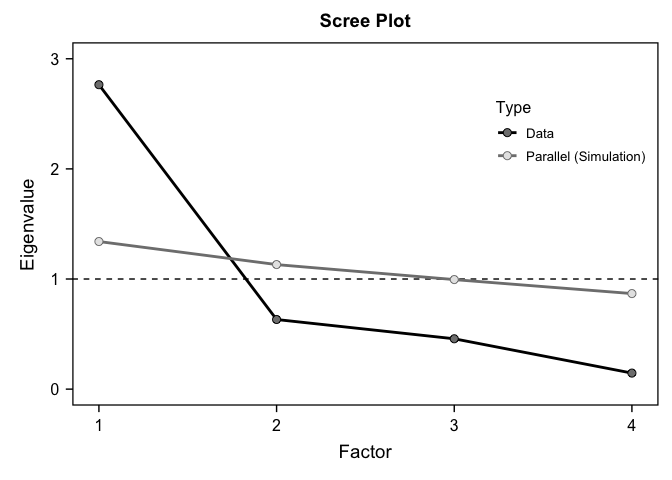<!-- -->

``` r
EFA(dataset, "A", 9:12, method = "pa", plot.scree = TRUE, nfactors = c("parallel"))
```

    ## 
    ## Explanatory Factor Analysis
    ## 
    ## Summary:
    ## Total Items: 4
    ## Scale Range: 1 ~ 5
    ## Total Cases: 104
    ## Valid Cases: 104 (100.0%)
    ## 
    ## Extraction Method:
    ## - Principal Axis Factor Analysis
    ## Rotation Method:
    ## - (Only one component was extracted. The solution was not rotated.)
    ## 
    ## KMO and Bartlett's Test:
    ## - Kaiser-Meyer-Olkin (KMO) Measure of Sampling Adequacy: MSA = 0.787
    ## - Bartlett's Test of Sphericity: Approx. χ²(6) = 135.01, p = 1e-26 ***
    ## 
    ## Total Variance Explained:
    ## ───────────────────────────────────────────────────────────────────────────────
    ##           Eigenvalue Variance % Cumulative % SS Loading Variance % Cumulative %
    ## ───────────────────────────────────────────────────────────────────────────────
    ## Factor 1       2.558     63.940       63.940      2.107     52.686       52.686
    ## Factor 2       0.636     15.904       79.844                                   
    ## Factor 3       0.441     11.014       90.859                                   
    ## Factor 4       0.366      9.141      100.000                                   
    ## ───────────────────────────────────────────────────────────────────────────────
    ## 
    ## Factor Loadings (Sorted by Size):
    ## ──────────────────────
    ##        PA1 Communality
    ## ──────────────────────
    ## A9   0.815       0.664
    ## A10  0.801       0.642
    ## A12  0.642       0.412
    ## A11  0.624       0.390
    ## ──────────────────────
    ## Communality = Sum of Squared (SS) Factor Loadings
    ## (Uniqueness = 1 - Communality)

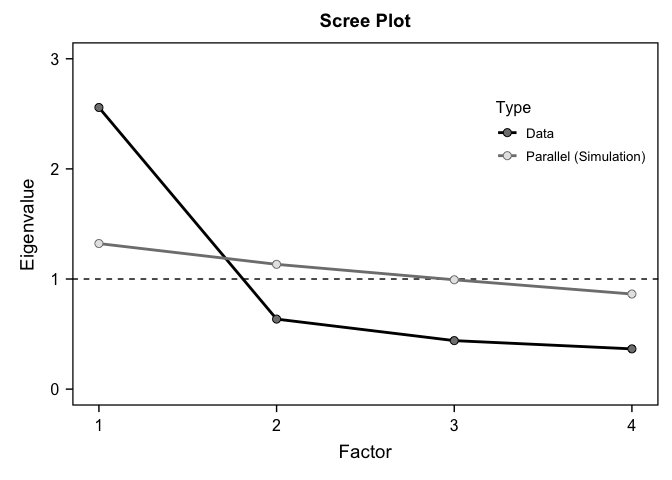<!-- -->
