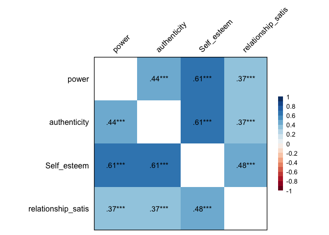

My project
================
Rainbow
2024-10-11

``` r
library(haven)
library(dplyr)
```

    ## 
    ## Attaching package: 'dplyr'

    ## The following objects are masked from 'package:stats':
    ## 
    ##     filter, lag

    ## The following objects are masked from 'package:base':
    ## 
    ##     intersect, setdiff, setequal, union

``` r
library(tidyr)
library(ggplot2)
library(psych)
```

    ## 
    ## Attaching package: 'psych'

    ## The following objects are masked from 'package:ggplot2':
    ## 
    ##     %+%, alpha

``` r
library(bruceR)
```

    ## 
    ## bruceR (v2024.6)
    ## Broadly Useful Convenient and Efficient R functions
    ## 
    ## Packages also loaded:
    ## ✔ data.table ✔ emmeans
    ## ✔ dplyr      ✔ lmerTest
    ## ✔ tidyr      ✔ effectsize
    ## ✔ stringr    ✔ performance
    ## ✔ ggplot2    ✔ interactions
    ## 
    ## Main functions of `bruceR`:
    ## cc()             Describe()  TTEST()
    ## add()            Freq()      MANOVA()
    ## .mean()          Corr()      EMMEANS()
    ## set.wd()         Alpha()     PROCESS()
    ## import()         EFA()       model_summary()
    ## print_table()    CFA()       lavaan_summary()
    ## 
    ## For full functionality, please install all dependencies:
    ## install.packages("bruceR", dep=TRUE)
    ## 
    ## Online documentation:
    ## https://psychbruce.github.io/bruceR
    ## 
    ## To use this package in publications, please cite:
    ## Bao, H.-W.-S. (2024). bruceR: Broadly useful convenient and efficient R functions (Version 2024.6) [Computer software]. https://CRAN.R-project.org/package=bruceR

    ## 
    ## These packages are dependencies of `bruceR` but not installed:
    ## - pacman, openxlsx, ggtext, lmtest, vars, phia, MuMIn, GGally
    ## 
    ## ***** Install all dependencies *****
    ## install.packages("bruceR", dep=TRUE)

``` r
library(ggsci)
library(see)
```

    ## 
    ## Attaching package: 'see'

    ## The following objects are masked from 'package:ggsci':
    ## 
    ##     scale_color_material, scale_colour_material, scale_fill_material

``` r
library(car)
```

    ## Loading required package: carData

    ## 
    ## Attaching package: 'car'

    ## The following object is masked from 'package:psych':
    ## 
    ##     logit

    ## The following object is masked from 'package:dplyr':
    ## 
    ##     recode

``` r
dataset <- read.csv("/Users/rainbow/Documents/project\ dataset.csv")
```

\#Recode variables

``` r
dataset <- dataset %>%
  mutate_at(c('gender'),funs(str_replace(., "1", "Men")))
```

    ## Warning: `funs()` was deprecated in dplyr 0.8.0.
    ## ℹ Please use a list of either functions or lambdas:
    ## 
    ## # Simple named list: list(mean = mean, median = median)
    ## 
    ## # Auto named with `tibble::lst()`: tibble::lst(mean, median)
    ## 
    ## # Using lambdas list(~ mean(., trim = .2), ~ median(., na.rm = TRUE))
    ## Call `lifecycle::last_lifecycle_warnings()` to see where this warning was
    ## generated.

``` r
dataset <- dataset %>%
  mutate_at(c('gender'),funs(str_replace(., "2", "Women")))
```

    ## Warning: `funs()` was deprecated in dplyr 0.8.0.
    ## ℹ Please use a list of either functions or lambdas:
    ## 
    ## # Simple named list: list(mean = mean, median = median)
    ## 
    ## # Auto named with `tibble::lst()`: tibble::lst(mean, median)
    ## 
    ## # Using lambdas list(~ mean(., trim = .2), ~ median(., na.rm = TRUE))
    ## Call `lifecycle::last_lifecycle_warnings()` to see where this warning was
    ## generated.

\#Normality \##Normality plots

``` r
ggplot(dataset, aes(x = relationship_satis)) + geom_histogram(binwidth = 5) + theme_classic()
```

<!-- -->

``` r
ggplot(dataset, aes(x = relationship_satis)) + geom_density(adjust = 2)  + theme_classic()
```

<!-- -->

``` r
qq<-ggplot(dataset, aes(sample = relationship_satis)) + geom_qq()  + theme_classic()

qq+ geom_qq_line()
```

<!-- -->
\###Normality plots by gender

``` r
ggplot(dataset, aes(x = relationship_satis)) + geom_histogram(binwidth = 5) + theme_classic() + facet_wrap(~gender) + theme_classic()
```

<!-- -->

``` r
ggplot(dataset, aes(x = relationship_satis)) + geom_density(adjust = 2)  + theme_classic() + facet_wrap(~gender) + theme_classic()
```

<!-- -->

``` r
qq<-ggplot(dataset, aes(sample = relationship_satis)) + geom_qq()  + theme_classic() + facet_wrap(~gender) + theme_classic()

qq+ geom_qq_line()+ facet_wrap(~gender) 
```

<!-- -->
\##Normality tests

``` r
describe(dataset$relationship_satis)
```

    ##    vars   n  mean   sd median trimmed  mad min max range  skew kurtosis   se
    ## X1    1 104 26.09 3.66     27   26.18 2.97  14  35    21 -0.45     0.89 0.36

``` r
shapiro.test(dataset$relationship_satis)
```

    ## 
    ##  Shapiro-Wilk normality test
    ## 
    ## data:  dataset$relationship_satis
    ## W = 0.95627, p-value = 0.00171

\###Normality tests by gender

``` r
?describeBy()

describeBy(relationship_satis ~ gender, data = dataset)
```

    ## 
    ##  Descriptive statistics by group 
    ## gender: Men
    ##                    vars  n  mean   sd median trimmed  mad min max range  skew
    ## relationship_satis    1 46 25.91 3.73     27   26.08 2.97  16  35    19 -0.53
    ##                    kurtosis   se
    ## relationship_satis     0.46 0.55
    ## ------------------------------------------------------------ 
    ## gender: Women
    ##                    vars  n  mean   sd median trimmed  mad min max range  skew
    ## relationship_satis    1 58 26.22 3.64     27   26.25 2.97  14  35    21 -0.36
    ##                    kurtosis   se
    ## relationship_satis     1.09 0.48

``` r
dataset %>%
  group_by(gender) %>%
  summarize(W = shapiro.test(relationship_satis)$statistic, p_value = shapiro.test(relationship_satis)$p.value)
```

    ## # A tibble: 2 × 3
    ##   gender     W p_value
    ##   <chr>  <dbl>   <dbl>
    ## 1 Men    0.945  0.0301
    ## 2 Women  0.955  0.0298

# Equal Variance between Groups

## Descrptive Variance

``` r
data_clean<-drop_na(dataset)

var(data_clean$relationship_satis)
```

    ## [1] 13.41962

``` r
data_clean %>%
  group_by(gender) %>%
  summarize(variance = var(relationship_satis))
```

    ## # A tibble: 2 × 2
    ##   gender variance
    ##   <chr>     <dbl>
    ## 1 Men        13.9
    ## 2 Women      13.2

## Equal Variance Test

``` r
leveneTest(relationship_satis~gender, data_clean)
```

    ## Warning in leveneTest.default(y = y, group = group, ...): group coerced to
    ## factor.

    ## Levene's Test for Homogeneity of Variance (center = median)
    ##        Df F value Pr(>F)
    ## group   1   5e-04 0.9828
    ##       102

``` r
MANOVA(data_clean, dv = "relationship_satis", between = "gender")
```

    ## 
    ## ====== ANOVA (Between-Subjects Design) ======
    ## 
    ## Descriptives:
    ## ───────────────────────────
    ##  "gender"   Mean    S.D.  n
    ## ───────────────────────────
    ##     Men   25.913 (3.729) 46
    ##     Women 26.224 (3.637) 58
    ## ───────────────────────────
    ## Total sample size: N = 104
    ## 
    ## ANOVA Table:
    ## Dependent variable(s):      relationship_satis
    ## Between-subjects factor(s): gender
    ## Within-subjects factor(s):  –
    ## Covariate(s):               –
    ## ─────────────────────────────────────────────────────────────────────
    ##            MS    MSE df1 df2     F     p     η²p [90% CI of η²p]  η²G
    ## ─────────────────────────────────────────────────────────────────────
    ## gender  2.483 13.527   1 102 0.184  .669       .002 [.000, .038] .002
    ## ─────────────────────────────────────────────────────────────────────
    ## MSE = mean square error (the residual variance of the linear model)
    ## η²p = partial eta-squared = SS / (SS + SSE) = F * df1 / (F * df1 + df2)
    ## ω²p = partial omega-squared = (F - 1) * df1 / (F * df1 + df2 + 1)
    ## η²G = generalized eta-squared (see Olejnik & Algina, 2003)
    ## Cohen’s f² = η²p / (1 - η²p)
    ## 
    ## Levene’s Test for Homogeneity of Variance:
    ## ────────────────────────────────────────────────────
    ##                         Levene’s F df1 df2     p    
    ## ────────────────────────────────────────────────────
    ## DV: relationship_satis       0.002   1 102  .963    
    ## ────────────────────────────────────────────────────

\#Summary Descriptive Statistics

``` r
data_clean %>%
  group_by(gender) %>%
  dplyr::summarize(mean_Self_esteem    = mean(Self_esteem),
      mean_relationship_satis    = mean(relationship_satis),
      std_dev_Self_esteem = sd(Self_esteem),
      std_dev_relationship_satis = sd(relationship_satis),
      corr_Self_esteem_relationship_satis  = cor(Self_esteem, relationship_satis))
```

    ## # A tibble: 2 × 6
    ##   gender mean_Self_esteem mean_relationship_satis std_dev_Self_esteem
    ##   <chr>             <dbl>                   <dbl>               <dbl>
    ## 1 Men                38.7                    25.9                5.26
    ## 2 Women              38.1                    26.2                4.96
    ## # ℹ 2 more variables: std_dev_relationship_satis <dbl>,
    ## #   corr_Self_esteem_relationship_satis <dbl>
