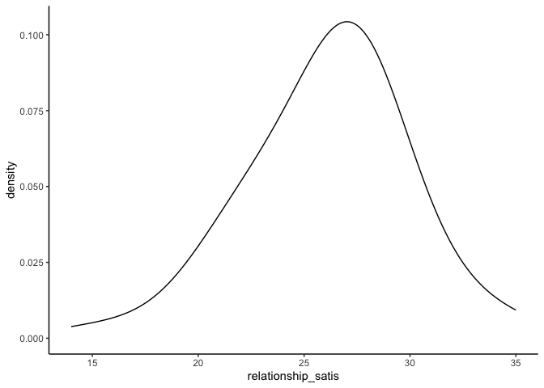

My project
================
Rainbow
2024-10-11

``` r
library(haven)
library(dplyr)
```

    ## 
    ## Attaching package: 'dplyr'

    ## The following objects are masked from 'package:stats':
    ## 
    ##     filter, lag

    ## The following objects are masked from 'package:base':
    ## 
    ##     intersect, setdiff, setequal, union

``` r
library(tidyr)
library(ggplot2)
library(psych)
```

    ## 
    ## Attaching package: 'psych'

    ## The following objects are masked from 'package:ggplot2':
    ## 
    ##     %+%, alpha

``` r
library(bruceR)
```

    ## 
    ## bruceR (v2024.6)
    ## Broadly Useful Convenient and Efficient R functions
    ## 
    ## Packages also loaded:
    ## ✔ data.table ✔ emmeans
    ## ✔ dplyr      ✔ lmerTest
    ## ✔ tidyr      ✔ effectsize
    ## ✔ stringr    ✔ performance
    ## ✔ ggplot2    ✔ interactions
    ## 
    ## Main functions of `bruceR`:
    ## cc()             Describe()  TTEST()
    ## add()            Freq()      MANOVA()
    ## .mean()          Corr()      EMMEANS()
    ## set.wd()         Alpha()     PROCESS()
    ## import()         EFA()       model_summary()
    ## print_table()    CFA()       lavaan_summary()
    ## 
    ## For full functionality, please install all dependencies:
    ## install.packages("bruceR", dep=TRUE)
    ## 
    ## Online documentation:
    ## https://psychbruce.github.io/bruceR
    ## 
    ## To use this package in publications, please cite:
    ## Bao, H.-W.-S. (2024). bruceR: Broadly useful convenient and efficient R functions (Version 2024.6) [Computer software]. https://CRAN.R-project.org/package=bruceR

    ## 
    ## These packages are dependencies of `bruceR` but not installed:
    ## - pacman, openxlsx, ggtext, lmtest, vars, phia, MuMIn, GGally
    ## 
    ## ***** Install all dependencies *****
    ## install.packages("bruceR", dep=TRUE)

``` r
library(ggsci)
library(see)
```

    ## 
    ## Attaching package: 'see'

    ## The following objects are masked from 'package:ggsci':
    ## 
    ##     scale_color_material, scale_colour_material, scale_fill_material

``` r
library(car)
```

    ## Loading required package: carData

    ## 
    ## Attaching package: 'car'

    ## The following object is masked from 'package:psych':
    ## 
    ##     logit

    ## The following object is masked from 'package:dplyr':
    ## 
    ##     recode

``` r
library(Rmisc)
```

    ## Loading required package: lattice

    ## Loading required package: plyr

    ## ------------------------------------------------------------------------------

    ## You have loaded plyr after dplyr - this is likely to cause problems.
    ## If you need functions from both plyr and dplyr, please load plyr first, then dplyr:
    ## library(plyr); library(dplyr)

    ## ------------------------------------------------------------------------------

    ## 
    ## Attaching package: 'plyr'

    ## The following objects are masked from 'package:dplyr':
    ## 
    ##     arrange, count, desc, failwith, id, mutate, rename, summarise,
    ##     summarize

``` r
library(rstatix)
```

    ## 
    ## Attaching package: 'rstatix'

    ## The following objects are masked from 'package:plyr':
    ## 
    ##     desc, mutate

    ## The following objects are masked from 'package:effectsize':
    ## 
    ##     cohens_d, eta_squared

    ## The following object is masked from 'package:stats':
    ## 
    ##     filter

``` r
library(emmeans)
library(labelled)
library(ggstatsplot)
```

    ## You can cite this package as:
    ##      Patil, I. (2021). Visualizations with statistical details: The 'ggstatsplot' approach.
    ##      Journal of Open Source Software, 6(61), 3167, doi:10.21105/joss.03167

``` r
library(performance)
library(sjPlot)
```

    ## Learn more about sjPlot with 'browseVignettes("sjPlot")'.

``` r
dataset <- read.csv("/Users/rainbow/Documents/project\ dataset.csv")
```

\#Recode variables

``` r
dataset <- dataset %>%
  mutate_at(c('gender'),funs(str_replace(., "1", "Men")))
```

    ## Warning: `funs()` was deprecated in dplyr 0.8.0.
    ## ℹ Please use a list of either functions or lambdas:
    ## 
    ## # Simple named list: list(mean = mean, median = median)
    ## 
    ## # Auto named with `tibble::lst()`: tibble::lst(mean, median)
    ## 
    ## # Using lambdas list(~ mean(., trim = .2), ~ median(., na.rm = TRUE))
    ## Call `lifecycle::last_lifecycle_warnings()` to see where this warning was
    ## generated.

``` r
dataset <- dataset %>%
  mutate_at(c('gender'),funs(str_replace(., "2", "Women")))
```

    ## Warning: `funs()` was deprecated in dplyr 0.8.0.
    ## ℹ Please use a list of either functions or lambdas:
    ## 
    ## # Simple named list: list(mean = mean, median = median)
    ## 
    ## # Auto named with `tibble::lst()`: tibble::lst(mean, median)
    ## 
    ## # Using lambdas list(~ mean(., trim = .2), ~ median(., na.rm = TRUE))
    ## Call `lifecycle::last_lifecycle_warnings()` to see where this warning was
    ## generated.

``` r
breaks <- c(20, 40, 50)
labels <- c("Low", "High")
  
dataset$SE_group <- cut(dataset$Self_esteem, breaks = breaks, labels = labels, right = FALSE)
```

\#Normality \##Normality plots

``` r
ggplot(dataset, aes(x = relationship_satis)) + geom_histogram(binwidth = 5) + theme_classic()
```

<!-- -->

``` r
ggplot(dataset, aes(x = relationship_satis)) + geom_density(adjust = 2)  + theme_classic()
```

<!-- -->

``` r
qq<-ggplot(dataset, aes(sample = relationship_satis)) + geom_qq()  + theme_classic()

qq+ geom_qq_line()
```

<!-- -->
\###Normality plots by gender

``` r
ggplot(dataset, aes(x = relationship_satis)) + geom_histogram(binwidth = 5) + theme_classic() + facet_wrap(~gender) + theme_classic()
```

<!-- -->

``` r
ggplot(dataset, aes(x = relationship_satis)) + geom_density(adjust = 2)  + theme_classic() + facet_wrap(~gender) + theme_classic()
```

<!-- -->

``` r
qq<-ggplot(dataset, aes(sample = relationship_satis)) + geom_qq()  + theme_classic() + facet_wrap(~gender) + theme_classic()

qq+ geom_qq_line()+ facet_wrap(~gender) 
```

<!-- -->
\##Normality tests

``` r
describe(dataset$relationship_satis)
```

    ##    vars   n  mean   sd median trimmed  mad min max range  skew kurtosis   se
    ## X1    1 104 26.09 3.66     27   26.18 2.97  14  35    21 -0.45     0.89 0.36

``` r
shapiro.test(dataset$relationship_satis)
```

    ## 
    ##  Shapiro-Wilk normality test
    ## 
    ## data:  dataset$relationship_satis
    ## W = 0.95627, p-value = 0.00171

### Normality tests by gender

``` r
?describeBy()

describeBy(relationship_satis ~ gender, data = dataset)
```

    ## 
    ##  Descriptive statistics by group 
    ## gender: Men
    ##                    vars  n  mean   sd median trimmed  mad min max range  skew
    ## relationship_satis    1 46 25.91 3.73     27   26.08 2.97  16  35    19 -0.53
    ##                    kurtosis   se
    ## relationship_satis     0.46 0.55
    ## ------------------------------------------------------------ 
    ## gender: Women
    ##                    vars  n  mean   sd median trimmed  mad min max range  skew
    ## relationship_satis    1 58 26.22 3.64     27   26.25 2.97  14  35    21 -0.36
    ##                    kurtosis   se
    ## relationship_satis     1.09 0.48

``` r
dataset %>%
  group_by(gender) %>%
  summarize(W = shapiro.test(relationship_satis)$statistic, p_value = shapiro.test(relationship_satis)$p.value)
```

    ##           W     p_value
    ## 1 0.9562674 0.001710247

# Equal Variance between Groups

## Descrptive Variance

``` r
data_clean<-drop_na(dataset)

var(data_clean$relationship_satis)
```

    ## [1] 13.41962

``` r
data_clean %>%
  group_by(gender) %>%
  summarize(variance = var(relationship_satis))
```

    ##   variance
    ## 1 13.41962

## Equal Variance Test

``` r
leveneTest(relationship_satis~gender, data_clean)
```

    ## Warning in leveneTest.default(y = y, group = group, ...): group coerced to
    ## factor.

    ## Levene's Test for Homogeneity of Variance (center = median)
    ##        Df F value Pr(>F)
    ## group   1   5e-04 0.9828
    ##       102

``` r
MANOVA(data_clean, dv = "relationship_satis", between = "gender")
```

    ## 
    ## ====== ANOVA (Between-Subjects Design) ======
    ## 
    ## Descriptives:
    ## ───────────────────────────
    ##  "gender"   Mean    S.D.  n
    ## ───────────────────────────
    ##     Men   25.913 (3.729) 46
    ##     Women 26.224 (3.637) 58
    ## ───────────────────────────
    ## Total sample size: N = 104
    ## 
    ## ANOVA Table:
    ## Dependent variable(s):      relationship_satis
    ## Between-subjects factor(s): gender
    ## Within-subjects factor(s):  –
    ## Covariate(s):               –
    ## ─────────────────────────────────────────────────────────────────────
    ##            MS    MSE df1 df2     F     p     η²p [90% CI of η²p]  η²G
    ## ─────────────────────────────────────────────────────────────────────
    ## gender  2.483 13.527   1 102 0.184  .669       .002 [.000, .038] .002
    ## ─────────────────────────────────────────────────────────────────────
    ## MSE = mean square error (the residual variance of the linear model)
    ## η²p = partial eta-squared = SS / (SS + SSE) = F * df1 / (F * df1 + df2)
    ## ω²p = partial omega-squared = (F - 1) * df1 / (F * df1 + df2 + 1)
    ## η²G = generalized eta-squared (see Olejnik & Algina, 2003)
    ## Cohen’s f² = η²p / (1 - η²p)
    ## 
    ## Levene’s Test for Homogeneity of Variance:
    ## ────────────────────────────────────────────────────
    ##                         Levene’s F df1 df2     p    
    ## ────────────────────────────────────────────────────
    ## DV: relationship_satis       0.002   1 102  .963    
    ## ────────────────────────────────────────────────────

\#Summary Descriptive Statistics

``` r
data_clean %>%
  group_by(gender) %>%
  dplyr::summarize(mean_Self_esteem    = mean(Self_esteem),
      mean_relationship_satis    = mean(relationship_satis),
      std_dev_Self_esteem = sd(Self_esteem),
      std_dev_relationship_satis = sd(relationship_satis),
      corr_Self_esteem_relationship_satis  = cor(Self_esteem, relationship_satis))
```

    ## # A tibble: 2 × 6
    ##   gender mean_Self_esteem mean_relationship_satis std_dev_Self_esteem
    ##   <chr>             <dbl>                   <dbl>               <dbl>
    ## 1 Men                38.7                    25.9                5.26
    ## 2 Women              38.1                    26.2                4.96
    ## # ℹ 2 more variables: std_dev_relationship_satis <dbl>,
    ## #   corr_Self_esteem_relationship_satis <dbl>

\#ANOVA \##Recode 2x2 into 1x4

``` r
data_clean$Group <- ifelse(data_clean$gender == "Women" & data_clean$SE_group == "High", "High SE Women", 
                     ifelse(data_clean$gender == "Men" & data_clean$SE_group == "High", "High SE Men", 
                            ifelse(data_clean$gender == "Women" & data_clean$SE_group == "Low", "Low SE Women", 
                                   "Low SE Men")))
```

\##contrast coefficients

``` r
#1st group is High SE Women, 
#2nd group is High SE men, 
#3rd group is Low SE Women,
#4th group is Low SE Men. 
```

\##Model and tests

``` r
mod<-MANOVA(data_clean, dv = "relationship_satis", between = c("gender", "SE_group")) 
```

    ## 
    ## ====== ANOVA (Between-Subjects Design) ======
    ## 
    ## Descriptives:
    ## ──────────────────────────────────────
    ##  "gender" "SE_group"   Mean    S.D.  n
    ## ──────────────────────────────────────
    ##     Men         Low  24.538 (3.701) 26
    ##     Men         High 27.700 (2.993) 20
    ##     Women       Low  25.000 (3.708) 33
    ##     Women       High 27.840 (2.882) 25
    ## ──────────────────────────────────────
    ## Total sample size: N = 104
    ## 
    ## ANOVA Table:
    ## Dependent variable(s):      relationship_satis
    ## Between-subjects factor(s): gender, SE_group
    ## Within-subjects factor(s):  –
    ## Covariate(s):               –
    ## ───────────────────────────────────────────────────────────────────────────────────
    ##                         MS    MSE df1 df2      F     p     η²p [90% CI of η²p]  η²G
    ## ───────────────────────────────────────────────────────────────────────────────────
    ## gender               2.279 11.520   1 100  0.198  .657       .002 [.000, .039] .002
    ## SE_group           226.867 11.520   1 100 19.693 <.001 ***   .165 [.068, .274] .165
    ## gender * SE_group    0.651 11.520   1 100  0.057  .813       .001 [.000, .026] .001
    ## ───────────────────────────────────────────────────────────────────────────────────
    ## MSE = mean square error (the residual variance of the linear model)
    ## η²p = partial eta-squared = SS / (SS + SSE) = F * df1 / (F * df1 + df2)
    ## ω²p = partial omega-squared = (F - 1) * df1 / (F * df1 + df2 + 1)
    ## η²G = generalized eta-squared (see Olejnik & Algina, 2003)
    ## Cohen’s f² = η²p / (1 - η²p)
    ## 
    ## Levene’s Test for Homogeneity of Variance:
    ## ────────────────────────────────────────────────────
    ##                         Levene’s F df1 df2     p    
    ## ────────────────────────────────────────────────────
    ## DV: relationship_satis       1.923   3 100  .131    
    ## ────────────────────────────────────────────────────

``` r
EMMEANS(mod, effect = "gender", by = "SE_group", p.adjust = "none")
```

    ## ------ EMMEANS (effect = "gender") ------
    ## 
    ## Joint Tests of "gender":
    ## ──────────────────────────────────────────────────────────────
    ##  Effect "SE_group" df1 df2     F     p     η²p [90% CI of η²p]
    ## ──────────────────────────────────────────────────────────────
    ##  gender       Low    1 100 0.269  .605       .003 [.000, .043]
    ##  gender       High   1 100 0.019  .891       .000 [.000, .016]
    ## ──────────────────────────────────────────────────────────────
    ## Note. Simple effects of repeated measures with 3 or more levels
    ## are different from the results obtained with SPSS MANOVA syntax.
    ## 
    ## Estimated Marginal Means of "gender":
    ## ────────────────────────────────────────────────────
    ##  "gender" "SE_group"   Mean [95% CI of Mean]    S.E.
    ## ────────────────────────────────────────────────────
    ##     Men         Low  24.538 [23.218, 25.859] (0.666)
    ##     Women       Low  25.000 [23.828, 26.172] (0.591)
    ##     Men         High 27.700 [26.194, 29.206] (0.759)
    ##     Women       High 27.840 [26.493, 29.187] (0.679)
    ## ────────────────────────────────────────────────────
    ## 
    ## Pairwise Comparisons of "gender":
    ## ────────────────────────────────────────────────────────────────────────────────────
    ##     Contrast "SE_group" Estimate    S.E.  df     t     p     Cohen’s d [95% CI of d]
    ## ────────────────────────────────────────────────────────────────────────────────────
    ##  Women - Men       Low     0.462 (0.890) 100 0.519  .605       0.136 [-0.384, 0.656]
    ##  Women - Men       High    0.140 (1.018) 100 0.137  .891       0.041 [-0.554, 0.636]
    ## ────────────────────────────────────────────────────────────────────────────────────
    ## Pooled SD for computing Cohen’s d: 3.394
    ## 
    ## Disclaimer:
    ## By default, pooled SD is Root Mean Square Error (RMSE).
    ## There is much disagreement on how to compute Cohen’s d.
    ## You are completely responsible for setting `sd.pooled`.
    ## You might also use `effectsize::t_to_d()` to compute d.

``` r
EMMEANS(mod, effect = "SE_group", by = "gender", p.adjust = "none")
```

    ## ------ EMMEANS (effect = "SE_group") ------
    ## 
    ## Joint Tests of "SE_group":
    ## ──────────────────────────────────────────────────────────────
    ##    Effect "gender" df1 df2     F     p     η²p [90% CI of η²p]
    ## ──────────────────────────────────────────────────────────────
    ##  SE_group    Men     1 100 9.808  .002 **    .089 [.020, .188]
    ##  SE_group    Women   1 100 9.959  .002 **    .091 [.021, .189]
    ## ──────────────────────────────────────────────────────────────
    ## Note. Simple effects of repeated measures with 3 or more levels
    ## are different from the results obtained with SPSS MANOVA syntax.
    ## 
    ## Estimated Marginal Means of "SE_group":
    ## ────────────────────────────────────────────────────
    ##  "SE_group" "gender"   Mean [95% CI of Mean]    S.E.
    ## ────────────────────────────────────────────────────
    ##        Low     Men   24.538 [23.218, 25.859] (0.666)
    ##        High    Men   27.700 [26.194, 29.206] (0.759)
    ##        Low     Women 25.000 [23.828, 26.172] (0.591)
    ##        High    Women 27.840 [26.493, 29.187] (0.679)
    ## ────────────────────────────────────────────────────
    ## 
    ## Pairwise Comparisons of "SE_group":
    ## ─────────────────────────────────────────────────────────────────────────────────
    ##    Contrast "gender" Estimate    S.E.  df     t     p     Cohen’s d [95% CI of d]
    ## ─────────────────────────────────────────────────────────────────────────────────
    ##  High - Low    Men      3.162 (1.010) 100 3.132  .002 **     0.931 [0.341, 1.522]
    ##  High - Low    Women    2.840 (0.900) 100 3.156  .002 **     0.837 [0.311, 1.363]
    ## ─────────────────────────────────────────────────────────────────────────────────
    ## Pooled SD for computing Cohen’s d: 3.394
    ## 
    ## Disclaimer:
    ## By default, pooled SD is Root Mean Square Error (RMSE).
    ## There is much disagreement on how to compute Cohen’s d.
    ## You are completely responsible for setting `sd.pooled`.
    ## You might also use `effectsize::t_to_d()` to compute d.

\##Visualization

``` r
plot<-summarySE(data_clean, measurevar="relationship_satis", groupvars=c("gender", "SE_group"))

plot
```

    ##   gender SE_group  N relationship_satis       sd        se       ci
    ## 1    Men      Low 26           24.53846 3.701143 0.7258539 1.494924
    ## 2    Men     High 20           27.70000 2.992974 0.6692494 1.400755
    ## 3  Women      Low 33           25.00000 3.708099 0.6454972 1.314835
    ## 4  Women     High 25           27.84000 2.882129 0.5764258 1.189684

``` r
plot2<-summarySE(data_clean, measurevar="relationship_satis", groupvars=c("Group"))

plot2
```

    ##           Group  N relationship_satis       sd        se       ci
    ## 1   High SE Men 20           27.70000 2.992974 0.6692494 1.400755
    ## 2 High SE Women 25           27.84000 2.882129 0.5764258 1.189684
    ## 3    Low SE Men 26           24.53846 3.701143 0.7258539 1.494924
    ## 4  Low SE Women 33           25.00000 3.708099 0.6454972 1.314835

``` r
ggplot(plot, aes(x = SE_group, y = relationship_satis, fill = SE_group)) +
  geom_col() + facet_wrap(~ gender) + theme_bruce()
```

<!-- -->

``` r
ggplot(plot2, aes(x = Group, y = relationship_satis, fill = Group)) +
  geom_col()  + theme_bruce() + theme(axis.text.x = element_text(angle = -10))
```

<!-- -->
\#Regression \##Correlation

``` r
regression <- data_clean %>%
  select(power, authenticity, Self_esteem, relationship_satis)

Corr(regression)
```

    ## Pearson's r and 95% confidence intervals:
    ## ────────────────────────────────────────────────────────────────
    ##                                     r     [95% CI]     p       N
    ## ────────────────────────────────────────────────────────────────
    ## power-authenticity               0.44 [0.27, 0.58] <.001 *** 104
    ## power-Self_esteem                0.61 [0.47, 0.72] <.001 *** 104
    ## power-relationship_satis         0.37 [0.19, 0.53] <.001 *** 104
    ## authenticity-Self_esteem         0.61 [0.47, 0.72] <.001 *** 104
    ## authenticity-relationship_satis  0.37 [0.19, 0.53] <.001 *** 104
    ## Self_esteem-relationship_satis   0.48 [0.32, 0.62] <.001 *** 104
    ## ────────────────────────────────────────────────────────────────

<!-- -->

    ## Correlation matrix is displayed in the RStudio `Plots` Pane.

\##Regression

``` r
model<-lm(relationship_satis ~ power + authenticity + Self_esteem, data = regression)

check_model(model)
```

<!-- -->

``` r
model_summary(model)
```

    ## 
    ## Model Summary
    ## 
    ## ────────────────────────────────────
    ##               (1) relationship_satis
    ## ────────────────────────────────────
    ## (Intercept)    10.728 ***           
    ##                (2.772)              
    ## power           0.109               
    ##                (0.106)              
    ## authenticity    0.069               
    ##                (0.065)              
    ## Self_esteem     0.245 **            
    ##                (0.089)              
    ## ────────────────────────────────────
    ## R^2             0.248               
    ## Adj. R^2        0.226               
    ## Num. obs.     104                   
    ## ────────────────────────────────────
    ## Note. * p < .05, ** p < .01, *** p < .001.
    ## 
    ## # Check for Multicollinearity
    ## 
    ## Low Correlation
    ## 
    ##          Term  VIF   VIF 95% CI Increased SE Tolerance Tolerance 95% CI
    ##         power 1.60 [1.31, 2.17]         1.27      0.62     [0.46, 0.76]
    ##  authenticity 1.60 [1.31, 2.16]         1.27      0.62     [0.46, 0.76]
    ##   Self_esteem 2.05 [1.62, 2.79]         1.43      0.49     [0.36, 0.62]

``` r
tab_model(model)
```

<table style="border-collapse:collapse; border:none;">
<tr>
<th style="border-top: double; text-align:center; font-style:normal; font-weight:bold; padding:0.2cm;  text-align:left; ">
 
</th>
<th colspan="3" style="border-top: double; text-align:center; font-style:normal; font-weight:bold; padding:0.2cm; ">
relationship_satis
</th>
</tr>
<tr>
<td style=" text-align:center; border-bottom:1px solid; font-style:italic; font-weight:normal;  text-align:left; ">
Predictors
</td>
<td style=" text-align:center; border-bottom:1px solid; font-style:italic; font-weight:normal;  ">
Estimates
</td>
<td style=" text-align:center; border-bottom:1px solid; font-style:italic; font-weight:normal;  ">
CI
</td>
<td style=" text-align:center; border-bottom:1px solid; font-style:italic; font-weight:normal;  ">
p
</td>
</tr>
<tr>
<td style=" padding:0.2cm; text-align:left; vertical-align:top; text-align:left; ">
(Intercept)
</td>
<td style=" padding:0.2cm; text-align:left; vertical-align:top; text-align:center;  ">
10.73
</td>
<td style=" padding:0.2cm; text-align:left; vertical-align:top; text-align:center;  ">
5.23 – 16.23
</td>
<td style=" padding:0.2cm; text-align:left; vertical-align:top; text-align:center;  ">
<strong>\<0.001</strong>
</td>
</tr>
<tr>
<td style=" padding:0.2cm; text-align:left; vertical-align:top; text-align:left; ">
power
</td>
<td style=" padding:0.2cm; text-align:left; vertical-align:top; text-align:center;  ">
0.11
</td>
<td style=" padding:0.2cm; text-align:left; vertical-align:top; text-align:center;  ">
-0.10 – 0.32
</td>
<td style=" padding:0.2cm; text-align:left; vertical-align:top; text-align:center;  ">
0.308
</td>
</tr>
<tr>
<td style=" padding:0.2cm; text-align:left; vertical-align:top; text-align:left; ">
authenticity
</td>
<td style=" padding:0.2cm; text-align:left; vertical-align:top; text-align:center;  ">
0.07
</td>
<td style=" padding:0.2cm; text-align:left; vertical-align:top; text-align:center;  ">
-0.06 – 0.20
</td>
<td style=" padding:0.2cm; text-align:left; vertical-align:top; text-align:center;  ">
0.292
</td>
</tr>
<tr>
<td style=" padding:0.2cm; text-align:left; vertical-align:top; text-align:left; ">
Self esteem
</td>
<td style=" padding:0.2cm; text-align:left; vertical-align:top; text-align:center;  ">
0.25
</td>
<td style=" padding:0.2cm; text-align:left; vertical-align:top; text-align:center;  ">
0.07 – 0.42
</td>
<td style=" padding:0.2cm; text-align:left; vertical-align:top; text-align:center;  ">
<strong>0.007</strong>
</td>
</tr>
<tr>
<td style=" padding:0.2cm; text-align:left; vertical-align:top; text-align:left; padding-top:0.1cm; padding-bottom:0.1cm; border-top:1px solid;">
Observations
</td>
<td style=" padding:0.2cm; text-align:left; vertical-align:top; padding-top:0.1cm; padding-bottom:0.1cm; text-align:left; border-top:1px solid;" colspan="3">
104
</td>
</tr>
<tr>
<td style=" padding:0.2cm; text-align:left; vertical-align:top; text-align:left; padding-top:0.1cm; padding-bottom:0.1cm;">
R<sup>2</sup> / R<sup>2</sup> adjusted
</td>
<td style=" padding:0.2cm; text-align:left; vertical-align:top; padding-top:0.1cm; padding-bottom:0.1cm; text-align:left;" colspan="3">
0.248 / 0.226
</td>
</tr>
</table>

``` r
plot_model(model,  type ="est",  show.values = TRUE, vline.color = "#1B191999", line.size = 1.5, dot.size = 2.5, colors = "blue") + theme_bruce()
```

<!-- -->
